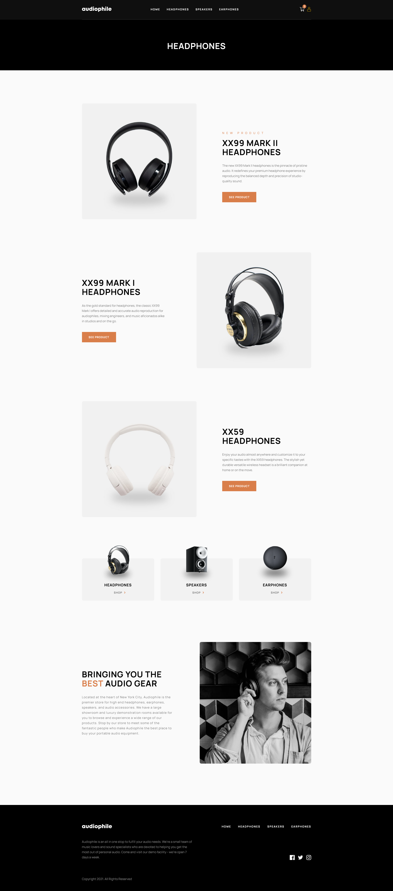
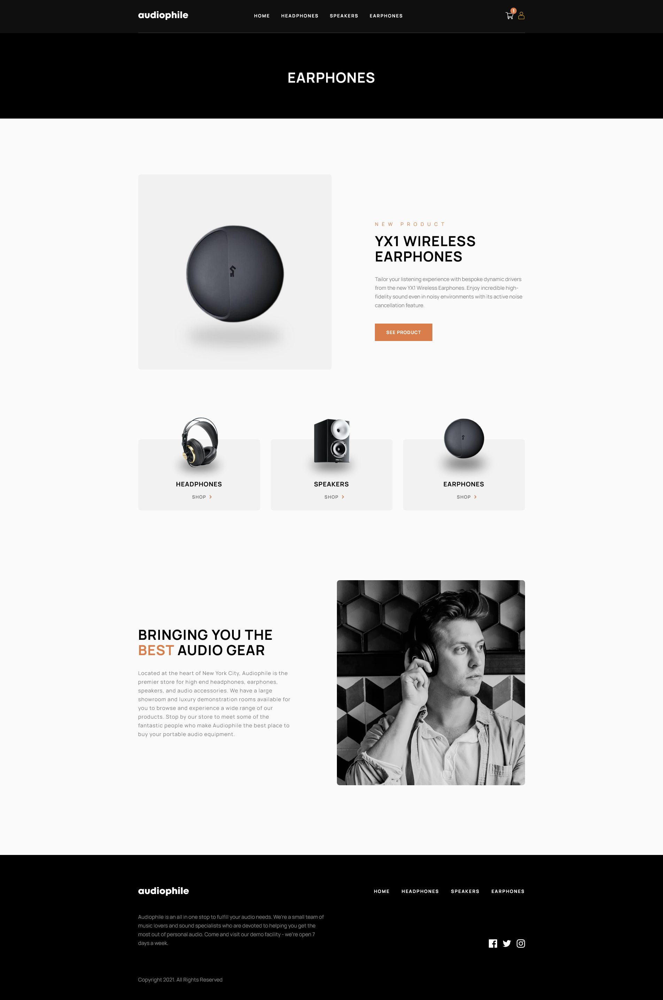
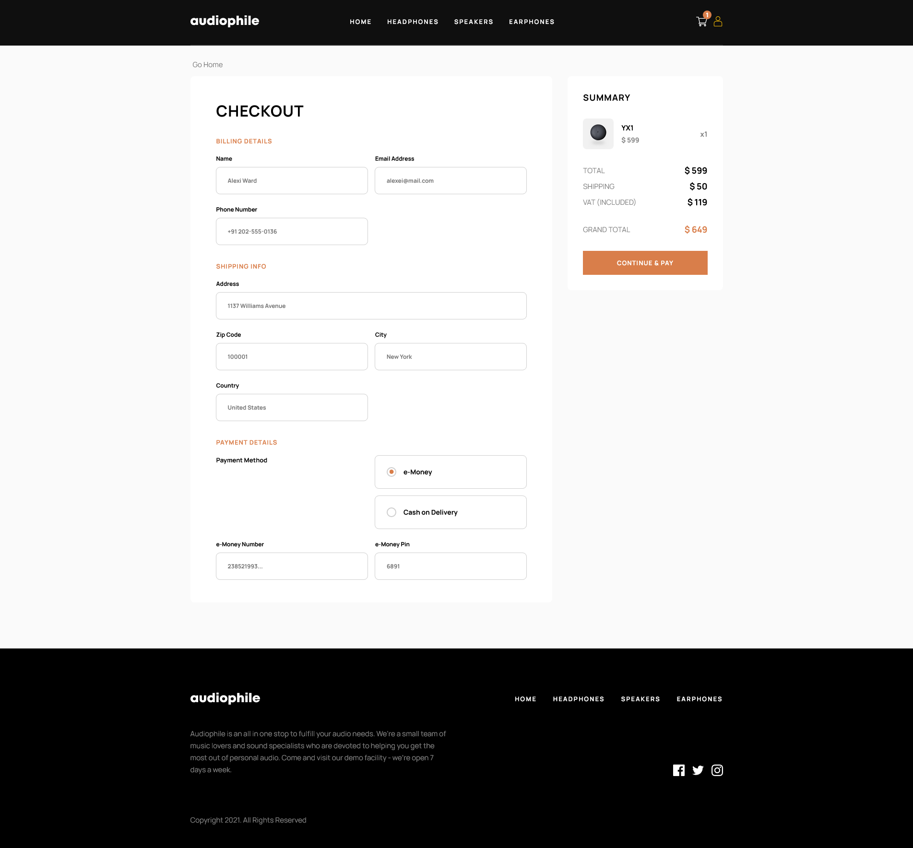

# Audiophile e-commerce website

## Table of contents

- [Overview](#overview)
  - [The Application](#the-challenge)
  - [Screenshot](#screenshot)
  - [Links](#links)
- [My process](#my-process)
  - [Built with](#built-with)
  - [Continued development](#continued-development)
- [Author](#author)
- [Acknowledgments](#acknowledgments)

## Overview

### The application

Users should be able to:

- View the optimal layout for the app depending on their device's screen size
- See hover states for all interactive elements on the page
- Add/Remove products from the cart
- Edit product quantities in the cart
- Fill in all fields in the checkout
- Receive form validations if fields are missed or incorrect during checkout
- See correct checkout totals depending on the products in the cart
  - Shipping always adds $50 to the order
  - VAT is calculated as 20% of the product total, excluding shipping
- See an order confirmation modal after checking out with an order summary
- Users can create an account and place orders.
- View the orders created in a custom account dashboard. Users can download their orders as pdf.

### Screenshot

### Links

- [Solution URL](https://www.frontendmentor.io/solutions/pern-stack-audiphile-website-with-supabase-auth-and-framer-motion-ihYQZeGni3)
- [Live Site URL](https://audiophileecom.netlify.app/)

## My process

### Built with

- CSS custom properties
- Mobile-first workflow
- [React](https://reactjs.org/) - JS library
- PostgresSQL
- Express.js
- Node.js
- SupabaseAuth
- Redux toolkit & Redux toolkit Query (RTKQuery)
- Framer motion
- Digital Ocean droplet instance

**Note: These are just examples. Delete this note and replace the list above with your own choices**

### Continued development

Potential things that I will consider adding in the future:-

- Forget password option.
- Integrate 3rd party authenticators (Sign in with google, github, microsoft etc).
- Add more features inside account dashboard.
- Integrate a proper payment gateway.
- Email notification sent to users.

### Useful resources

- [net ninja](https://netninja.dev/courses) - This helped me for Studying javascript. I really liked this course and i highly recommend to begginers.
- [Kevin Powell](https://www.youtube.com/kepowob) - This person is extremely talented and has helped me learn most of the things i know in CSS. highly recommend to anyone who is studying CSS.
- [coder coder](https://www.youtube.com/c/TheCoderCoder) - The person who I followed along to make this challenge. Really recommend her channel for people who are just starting out.

## Author

- [My website](https://mohsins-solutions.netlify.app/)
- Frontend Mentor - [@mohsin316](https://www.frontendmentor.io/profile/mohsin316)
- Twitter - [@Mohsin_316](https://twitter.com/Mohsin_316)
- Instagram - [@mohsin.k21](https://www.instagram.com/mohsin.k21/)
